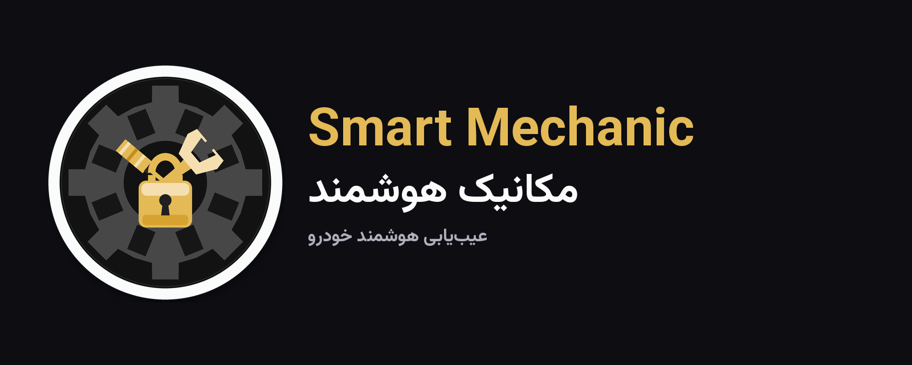

# 🚗 مکانیک هوشمند (Smart Mechanic)

<div align="center">



[](https://flutter.dev)
[](https://dart.dev)
[](https://developer.android.com)
[](RELEASE.md)
[](LICENSE)

**عیب‌یابی هوشمند خودرو با کمک هوش مصنوعی، تحلیل صدا و نقشه تعمیرگاه‌های نزدیک**

[راهنمای انتشار](RELEASE.md) · [برندینگ](BRANDING.md) · [قوانین استفاده](TERMS.md) · [حریم خصوصی](PRIVACY.md) · [سلب مسئولیت](DISCLAIMER.md)

</div>

---

## ⚠️ سلب مسئولیت

> اپلیکیشن «مکانیک هوشمند» یک ابزار **کمکی و اطلاعاتی** است.  
> تشخیص‌های ارائه‌شده **جایگزین نظر مکانیک حرفه‌ای** نیستند.

متن کامل: [DISCLAIMER.md](DISCLAIMER.md)

---

## ✨ ویژگی‌ها

| ویژگی | توضیح |
|-------|--------|
| 🧠 عیب‌یابی با AI | تشخیص مشکل، علل احتمالی و راه‌حل از طریق گفتگو |
| 🎤 تحلیل صدای موتور | استخراج RMS، فرکانس غالب، طیف فرکانسی |
| 📍 تعمیرگاه نزدیک | نقشه تعمیرگاه‌ها از دیتابیس خود اپ |
| 🔐 ورود OTP | احراز هویت با شماره موبایل |
| 💳 اعتبار و اشتراک | بسته‌های اعتباری + اشتراک طلایی |
| 👥 سیستم معرفی | کد معرف، پاداش و برداشت |
| 📋 تاریخچه | ذخیره و مرور عیب‌یابی‌های قبلی |
| 🌙 تم تاریک/روشن | طراحی مدرن با فونت وزیرمتن |

---

## 🧱 معماری

```
lib/
├── constants.dart
├── main.dart
├── models/
├── providers/                 # Auth, Theme, Locale
├── screens/
├── services/
├── theme/
│   ├── app_theme.dart
│   └── brand.dart             # هویت، رنگ، مسیر لوگو
└── widgets/
    ├── brand_logo.dart
    └── car_selector_widget.dart
```

- **State:** Provider  
- **Storage:** Hive + Secure Storage  
- **Package ID:** `ir.smartmec.app`

---

## 🚀 اجرا

```bash
git clone https://github.com/Tahmoures54/smart-mechanic-flutter.git
cd smart-mechanic-flutter
flutter pub get
python3 tool/generate_branding.py   # اگر آیکون‌ها را از نو می‌سازید
dart run flutter_launcher_icons
flutter run
```

---

## 📦 انتشار

جزئیات: [RELEASE.md](RELEASE.md)

بیلد یک APK برای گوشی‌های امروزی (arm64) و یک AAB برای گوگل‌پلی می‌سازد:

```bash
flutter build apk --release --target-platform android-arm64 --obfuscate --split-debug-info=build/symbols
flutter build appbundle --release --target-platform android-arm64 --obfuscate --split-debug-info=build/symbols
```

کلید امضای Play و بازار را یک‌بار با `scripts/generate_release_keystore.sh` یا workflow **Generate Play / Bazaar Upload Key** بسازید.

---

## 📄 مجوز

[MIT](LICENSE)
